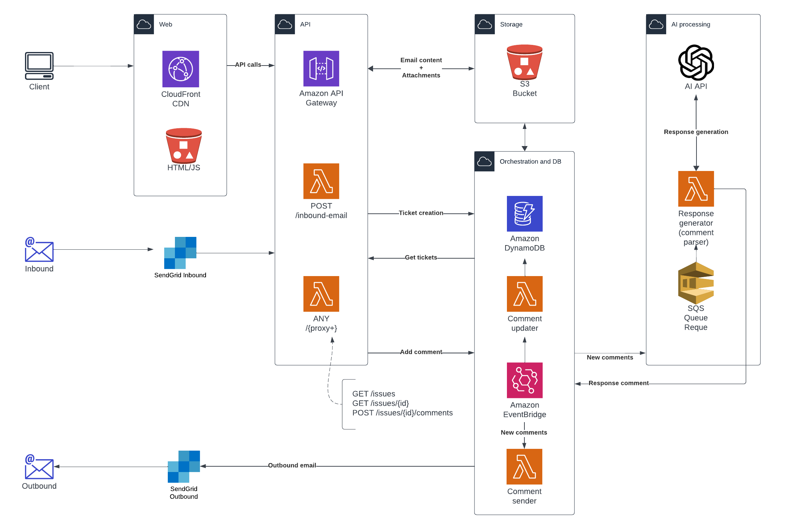

# AWS CDK IaC Serverless Workshop

## About this project

This project demonstrates some of the capabilities of AWS IaC and Serverless.

The application is an IT support ticket system with fairly sarcastic, somewhat douche-y, auto-generated responses.
It also has an administration interface for support staff to add comments to tickets,
which are automatically sent to the ticket creator,
as well as support for _internal_ messages that are not sent to the customer.

### Overview

An overview chart of the application:

### Services used

It utilizes the following AWS Serverless services:

* API Gateway
* Lambda (Compute)
* DynamoDB (Database)
* SQS (Queueing)
* EventBridge (Event bus/distribution)
* S3 (Object storage)

...and these external services:

* SendGrid Inbound Parse (receiving emails)
* SendGrid Email API (sending emails)
* OpenAI (generating snarky responses)

### Disclaimer

This code is a proof of concept. Do NOT use this code in production, but feel free to be inspired by it or scoff at it.

Some of the code, quite frankly, is somewhat embarrassing.

## Prerequisites

### AWS setup

See this link for step by step instructions: [Step by step AWS account configuration](https://chat.openai.com/share/b71b3ba1-e9dc-4af9-9011-8357c37176d6)

> [!NOTE]
> This demo project might incur charges to your AWS account depending on your usage, however only deploying the resources should incur no cost.

- AWS account
- AWS Command Line Interface (CLI) installed locally
- Create a non-root (named) IAM user, and get credentials for AWS CLI
- Configure AWS CLI credentials

### Local development tools

- Node.js installed locally
    - [https://nodejs.org/en/download/](https://nodejs.org/en/download/)
- AWS CDK installed locally (global install)
    - Open a command prompt, run `npm install -g aws-cdk`
- Your preferred IDE
    - VSCode: https://code.visualstudio.com/
    - Fleet: https://www.jetbrains.com/fleet/

### External services

This project uses

#### SendGrid for inbound and outbound emails

Other email services could also be used with some code modification,
but Sendgrid offers a free tier that should be enough for demonstration purposes: https://sendgrid.com/en-us/pricing

#### OpenAI for response generation

You will need to create an API key with OpenAI to use this, I think there is a minimum of $5 that needs to be paid
in order to use the API.

Read more here: https://platform.openai.com/docs/overview

### Secrets / API Keys

Configure relevant API Keys as SSM Secret Parameters: [AWS SSM Parameter documentation](https://docs.aws.amazon.com/systems-manager/latest/userguide/parameter-create-console.html)

- OpenAI API key
    - Named `/demo/openai/apikey`
- Sendgrid API key
    - Named `/demo/sendgrid/apikey`

## Resources

Some good resources to getting started with AWS IaC

- Getting started with AWS CDK, step by step guid with explanation of concepts
    - [https://cdkworkshop.com/](https://cdkworkshop.com/)
- Deploying websites in AWS CDK
    - [https://aws-cdk.com/deploying-a-static-website-using-s3-and-cloudfront](https://aws-cdk.com/deploying-a-static-website-using-s3-and-cloudfront)
- Serverless Stack AWS CDK "wrapper" - increases development speed tremendously, simplifies and abstracts some AWS CDK complexities
    - Getting started: [https://sst.dev/](https://sst.dev/)
    - SST in 100 seconds (video): [https://www.youtube.com/watch?v=JY_d0vf-rfw](https://www.youtube.com/watch?v=JY_d0vf-rfw)

## Useful commands

* `npm run build`   compile typescript to js
* `npm run watch`   watch for changes and compile
* `npm run test`    perform the jest unit tests
* `npx cdk deploy`  deploy this stack to your default AWS account/region
* `npx cdk diff`    compare deployed stack with current state
* `npx cdk synth`   emits the synthesized CloudFormation template
